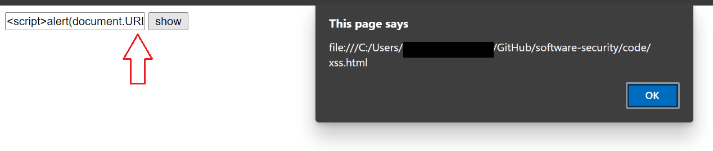
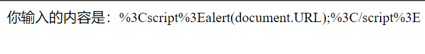

# XSS攻击实验

# 实验目的

* 理解和掌握XSS基本原理

# 实验原理

> Cross-Site Scripting (XSS) attacks are a type of injection, in which malicious scripts are injected into otherwise benign and trusted websites. XSS attacks occur when an attacker uses a web application to send malicious code, generally in the form of a browser side script, to a different end user. Flaws that allow these attacks to succeed are quite widespread and occur anywhere a web application uses input from a user within the output it generates without validating or encoding it.

## 实验内容

## 构建XSS漏洞

> DOM Based XSS (or as it is called in some texts, “type-0 XSS”) is an XSS attack wherein the attack payload is executed as a result of modifying the DOM “environment” in the victim’s browser used by the original client side script, so that the client side code runs in an “unexpected” manner. That is, the page itself (the HTTP response that is) does not change, but the client side code contained in the page executes differently due to the malicious modifications that have occurred in the DOM environment.

* 构建有DOM XSS漏洞的网页代码

  ```html
  <!DOCTYPE html>
  <html>
  <body>
      <script>
      function displayTxt(){
          var c=document.getElementById("xss").value;
          document.write("你输入的内容是："+c);
      }
      </script>
      <input type="text" name="txt" id='xss' />
      <input type="button" value="show"  onclick="displayTxt();" />
  </body>
  </html>
  
  <!-- <script>alert(document.URL);</script> -->
  ```

* 打开网页，在表单中键入`<script>alert(document.URL);`，提交表单。网页会弹窗显示网页的URL地址，证明该页面存在XSS漏洞

  

## 填补漏洞

* 由于对用户输入的信息中的未进行过滤，导致恶意代码得以被执行

* 因此只需要对用户输入信息进行转义即可

  ```javascript
  var c=encodeURI(document.getElementById("xss").value);
  ```

* 再次提交先前的恶意代码，结果显示了被转义后的内容

  

