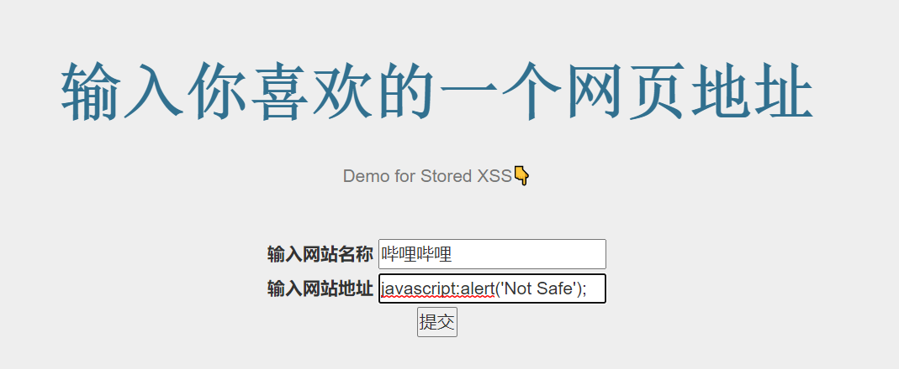
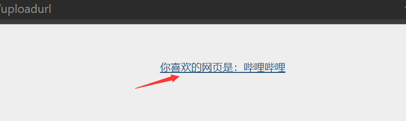
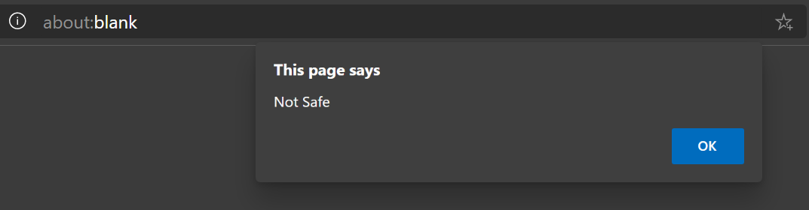
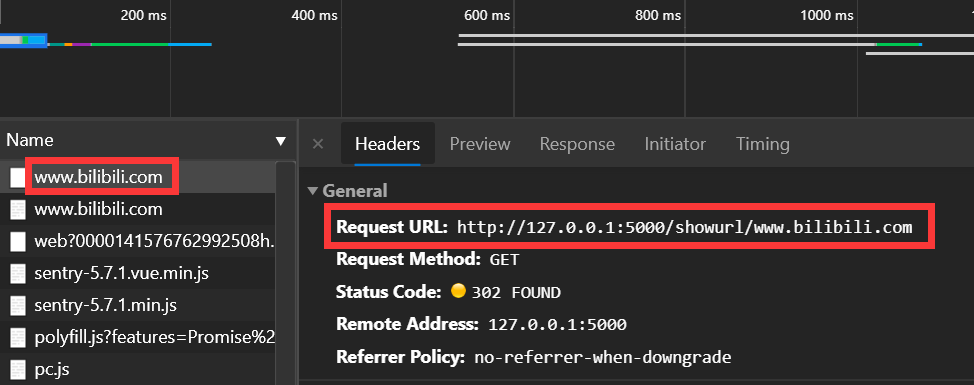
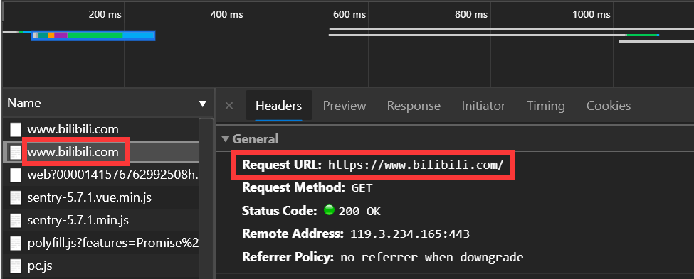

# XSS攻击实验

# 实验目的

* 理解和掌握XSS基本原理

# 实验原理

> Cross-Site Scripting (XSS) attacks are a type of injection, in which malicious scripts are injected into otherwise benign and trusted websites. XSS attacks occur when an attacker uses a web application to send malicious code, generally in the form of a browser side script, to a different end user. Flaws that allow these attacks to succeed are quite widespread and occur anywhere a web application uses input from a user within the output it generates without validating or encoding it.

# 实验内容

## 0. DOM Based XSS

### 概念

* DOM：文档对象模型（Document Object Model，简称DOM）

* DOM Based XSS

  > DOM Based XSS (or as it is called in some texts, “type-0 XSS”) is an XSS attack wherein the attack payload is executed as a result of modifying the DOM “environment” in the victim’s browser used by the original client side script, so that the client side code runs in an “unexpected” manner. That is, the page itself (the HTTP response that is) does not change, but the client side code contained in the page executes differently due to the malicious modifications that have occurred in the DOM environment.

### 实现

* 构建有DOM XSS漏洞的网页代码

  ```html
  <!DOCTYPE html>
  <html>
  <body>
      <script>
      function displayTxt(){
          var c=document.getElementById("xss").value;
          document.write("你输入的内容是："+c);
      }
      </script>
      <input type="text" name="txt" id='xss' />
      <input type="button" value="show"  onclick="displayTxt();" />
  </body>
  </html>
  
  <!-- <script>alert(document.URL);</script> -->
  ```

  * 如果在写之前没有调用`document.open`, 浏览器会自动调用open。每次写完关闭之后重新调用该函数，会导致页面被重写

* 打开网页，在表单中键入`<script>alert(document.URL);`，提交表单。网页会弹窗显示网页的URL地址，证明该页面存在XSS漏洞

  

### 填补漏洞

* 由于对用户输入的信息中的未进行过滤，导致恶意代码得以被执行

* 因此只需要对用户输入信息进行转义即可

  ```javascript
  var c=encodeURI(document.getElementById("xss").value);
  ```

* 再次提交先前的恶意代码，结果显示了被转义后的内容

  

## 1. Stored XSS

### 概念

*  Stored XSS

  > Stored XSS occurs when a web application gathers input from a user which might be malicious, and then stores that input in a data store for later use. The input that is stored is not correctly filtered. As a consequence, the malicious data will appear to be part of the web site and run within the user’s browser under the privileges of the web application. Since this vulnerability typically involves at least two requests to the application, this may also called second-order XSS.

* Flask

  > * Flask configures Jinja2 to automatically escape all values unless explicitly told otherwise. This should rule out all XSS problems caused in templates, but there are still other places where you have to be careful
  > * There is one class of XSS issues that Jinja’s escaping does not protect against. The `a` tag’s `href` attribute can contain a javascript: URI, which the browser will execute when clicked if not secured properly

### 实现

* 构建有Stored XSS漏洞的网页代码

  * `xss_flask,py`核心部分

    ```python
    @app.route('/')
    def index():
        return render_template("xss_idx.html")
    
    
    @app.route('/uploadurl', methods=['POST', 'GET'])
    def uploadurl():
        if request.method == 'POST':
            if 'web' in request.form.keys():
                name = request.form['web']
            if 'url' in request.form.keys():
                url = request.form['url']
            return render_template("xss_show_url.html", name=name, url=url)
        return render_template("xss_idx.html")
    ```

  * `xss_idx.html`核心部分

    ```html
    <form method=POST enctype=multipart/form-data action="{{ url_for('uploadurl') }}">
                <label>输入网站名称</label>
                <input type="text" name="web"><br>
                <label>输入网站地址</label>
                <input type="text" name="url"><br>
                <input type=submit onclick="alert('成功')" name="submit" value="提交">
    </form>
    ```

  * `xss_show_url.html`核心部分

    ```html
    <div class="container" align="center">
        <a href="{{url}}" target="_blank">你喜欢的网页是：{{name}}</a>
    
    </div>
    ```

* 在`网站地址`表单输入恶意代码并提交

  

* 刚刚输入的信息被存储在展示页面

  

* 点击，触发恶意代码

  

  * Remark：哔哩哔哩仅为测试用例，与本人兴趣倾向无关；

## 改进

* 对输入进行检测

  * 在`xss_flask.py`中添加

    ```python
    @app.route('/showurl/<string:_url>')
    def showurl(_url):
        if not (_url.startswith('http://') or _url.startswith('https://')):  
            _url="https://"+_url
            '''
            对特殊符号过滤&转义
            '''
        return redirect(_url)
    ```

  * 修改`xss_show_url`

    ```html
    <a href="{{url_for('showurl',_url=url)}}" target="_blank">你喜欢的网页是：{{name}}</a>
    ```

  * 事实上只通过强制加上`http`前缀，就修正了刚刚的问题；并且当今浏览器，也已大多自动屏蔽了形如`http://local.abc.com/?r=abc/index&param=<script>alert(1)</script>`的反射型XSS

### 常见问题解决

* 如果想通过`href`或重定向`redirect`到输入网址，需要提供带`http`前缀的完整地址；否则Flask会自动默认补到当前前缀后(e.g. `localhost:5000/www.bilibili.com`)

  

  

## 2. 自动化测试

### 环境

* `Chromium Edge`+`selenium`+`WebDriver`

### 实现

* 针对👆上面的`Stored XSS`例子

  ```python
  from selenium import webdriver
  from selenium.webdriver.common.keys import Keys
  
  driver = webdriver.Edge()
  driver.get('localhost:5000') # flask_url
  e1 = driver.find_element_by_name('web')
  e2 = driver.find_element_by_name('url')
  e3=driver.find_element_by_name('submit')
  
  e1.send_keys("bilibili")
  e2.send_keys("javascript:alert('notsafe');")
  e3.send_keys("",Keys.ARROW_DOWN)
  ```

* 结果

  * 页面弹出并快速的键入信息并关闭。相当于已将恶意代码存储到了服务器。

# 参考资料

[Cross-site Scripting (XSS) - OWASP](https://www.owasp.org/index.php/Cross-site_Scripting_(XSS))

[Testing for Stored Cross site scripting (OTG-INPVAL-002) - OWASP](https://www.owasp.org/index.php/Testing_for_Stored_Cross_site_scripting_(OTG-INPVAL-002))

[Security Considerations — Flask Documentation ](http://www.google.com/url?sa=t&rct=j&q=&esrc=s&source=web&cd=1&ved=2ahUKEwjf3JfGzcHmAhXBFYgKHePtBiIQFjAAegQIAxAB&url=http%3A%2F%2Fflask.pocoo.org%2Fdocs%2F1.0%2Fsecurity%2F&usg=AOvVaw1VQJhuE4S7-V9ywwH4NZCL)

[前端XSS相关整理 - -渔人码头- - 博客园](https://www.cnblogs.com/imwtr/p/9721563.html)

[Selenium with Python中文翻译文档 — Selenium-Python中文文档](https://selenium-python-zh.readthedocs.io/en/latest/index.html)