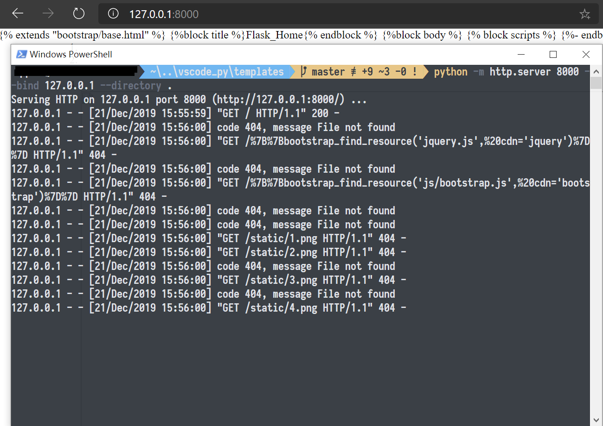
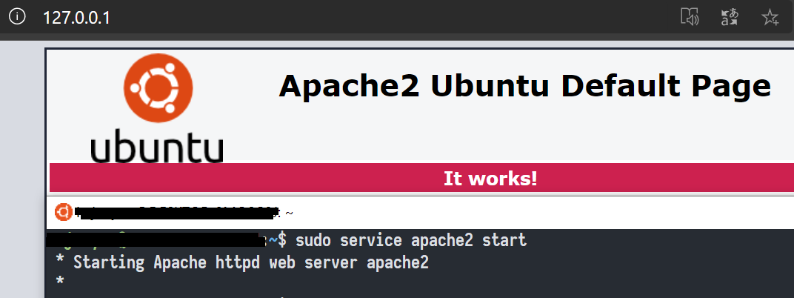
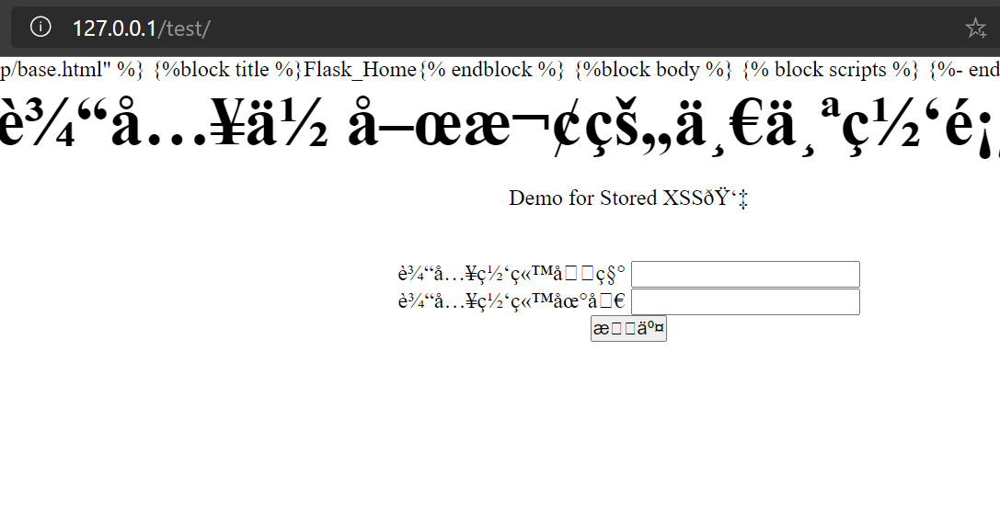
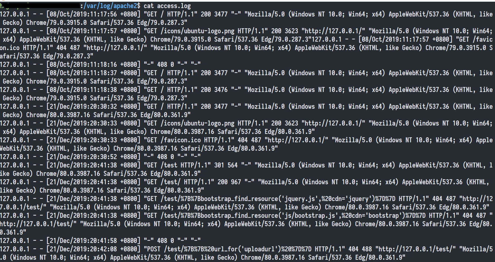
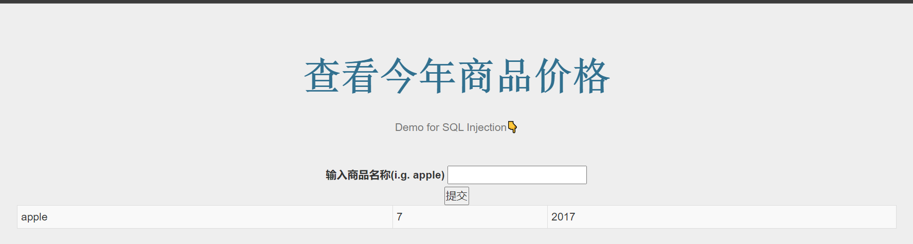
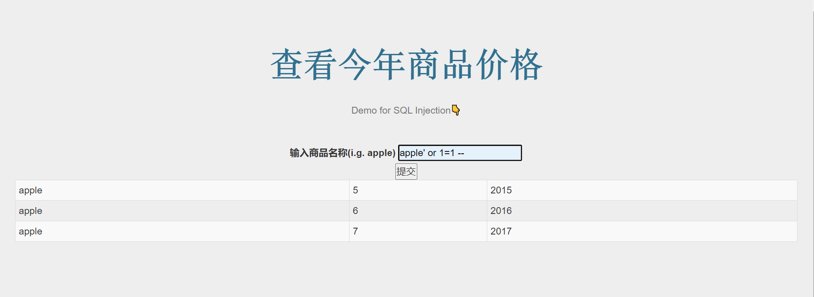
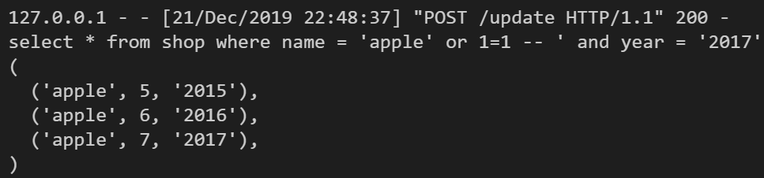
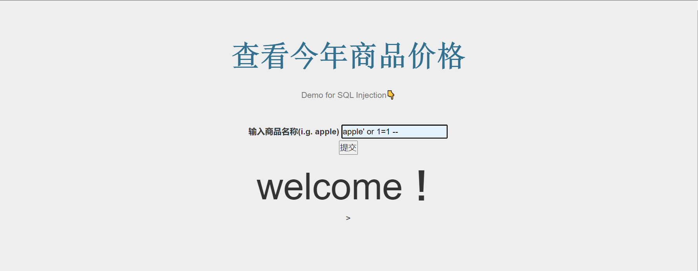

# Webserver以及SQL注入实验

# 实验内容

* 搭建简易Webserver
  * http.sever
  * apache
* 实现简单的sql注入

# 0. 简易Webserver

## 概念

**webserver**

> A web server is server software, or hardware dedicated to running said software, that can satisfy World Wide Web client requests. A web server can, in general, contain one or more websites. A web server processes incoming network requests over HTTP and several other related protocols.

## 实现

**`http.server`**

* `http.server`允许我们搭建一个简易的网页服务器。

  * 创建一个`index.htm`(或者`index.html`)

  * 在终端中键入`python - m python -m http.server 8000 --bind 127.0.0.1 --directory /yourpath/index.html`

  * 在浏览器中打开`localhost:8000`

    

**`Apache`**

* 安装：`sudo apt-get install apache2`

  * `wsl-ubuntu`自带

* 启动：`sudo service apache2 start`，访问`127.0.0.1`

  

* 在`/var/www/html`下创建子目录和`index.html`

  * 在`wsl`下可以`sudo cp /mnt/yourpath/index.html /var/www/html/subpath`

  * 访问`localhost/subpath`

    

* 查看log

  

# 1. WSIG+Flask

## 概念

**WSGI**

> Web服务器网关接口（Python Web Server Gateway Interface，缩写为WSGI）是为Python语言定义的Web服务器和Web应用程序或框架之间的一种简单而通用的接口。
>
> * 以前，如何选择合适的Web应用程序框架成为困扰Python初学者的一个问题，这是因为，一般而言，Web应用框架的选择将限制可用的Web服务器的选择，反之亦然。
> * 而WSGI是作为Web服务器与Web应用程序或应用框架之间的一种低级别的接口，以提升可移植Web应用开发的共同点。WSGI是基于现存的CGI标准而设计的。

**WSGI与Flask**

> `flask`, `django` and many other frameworks all implement this interface. So when you write an app in `flask`, `app` implements `wsgi` so any web server that knows how to serve a `wsgi` app can serve it.

# 2. 利用Flask实现SQL注入动态页面

## 准备

* 创建`shopping.shop`表

  ```mysql
  mysql> select * from shopping.shop;
  +-------+-------+------+
  | name  | value | year |
  +-------+-------+------+
  | apple |     5 | 2015 |
  | apple |     6 | 2016 |
  | apple |     7 | 2017 |
  +-------+-------+------+
  ```

## 实现

* `sql_flask.py`主体

  ```python
  global cyear
  cyear = '2017'
  
  
  @app.route('/')
  def index():
      return render_template("sql_idx.html", table=None)
  
  
  @app.route('/update', methods=['POST', 'GET'])
  def update():
      if request.method == 'POST':
          if 'name' in request.form.keys():
              name = request.form['name']
              table = sql_search(name)
              if table != None or table != ():
                  return render_template("sql_idx.html", table=table)
      return render_template("sql_idx.html", table=None)
  
  
  def sql_search(name):
      global cyear
      db = pymysql.connect('localhost', 'username', 'password', 'shopping')
      cursor = db.cursor()
      sql = "select * from shop where name = '{item_name}' and year = '{curnt_year}'".format(item_name=name, curnt_year=cyear)
      try:
          cursor.execute(sql)
          table = cursor.fetchall()
          return table
      except:
          db.rollback()
      db.close()
  ```

* `sql_idx.html`关键部分

  ```html
  <tbody>
      
      
      <tr>
          
          <td>{{ info }}</td>
          
      </tr>
      
      
      <h1>welcome！</h1>>
      
  </tbody>
  ```

## 结果

* 正常查询：`apple`

  

* 尝试注释型SQL注入：`apple' or 1=1 --`

  
* `1=1`永远成立，`--`注释掉后面的SQL语句。因此相当于退化为`select * from shop`
  
  

## 改进

* 其实`pymysql`自带对SQL注入的防御——转义。正确的做法是不要在`%s`外加上引号`'`

  ```python
  sql = "select * from shop where name = %s and year = %s"
  cursor.execute(sql,(name,cyear))
  ```

  
  
  > Python drivers do not use real query parameters. In python, the argument (the variable `attack` in your example) is interpolated into the SQL string before sending the SQL to the database server.
  >
  > This is not the same as using a query parameter. In a real parameterized query, the SQL string is sent to the database server with the parameter placeholder intact.
  >
  > But the Python driver does do properly escape the argument as they interpolate, which protects against SQL injection.
  >
  > ```python
  > # code
  > sqls="select id from tables where name=%s"
  > attack="jason' and 1=1"
  > cursor.execute(sqls,attack)
  > # log
  > 180802  8:50:47    14 Connect   root@localhost on test
  >            14 Query SET @@session.autocommit = OFF
  >            14 Query select id from tables where name='jason\' and 1=1'
  >            14 Quit 
  > ```

# 参考内容

[python - How to serve Flask With Http Server - Stack Overflow](https://stackoverflow.com/questions/55840782/how-to-serve-flask-with-http-server)

[python - How do PyMySQL prevent user from sql injection attack? - Stack Overflow](https://stackoverflow.com/questions/51647301/how-do-pymysql-prevent-user-from-sql-injection-attack)

