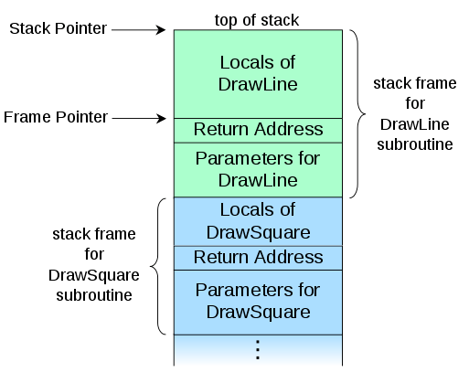
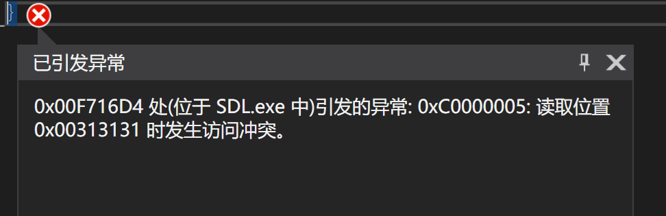
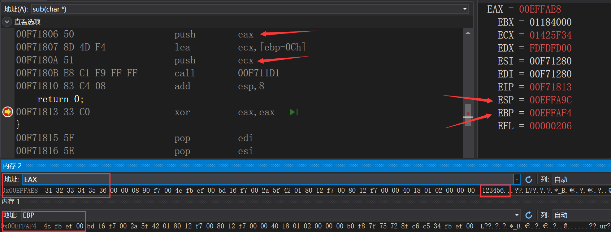
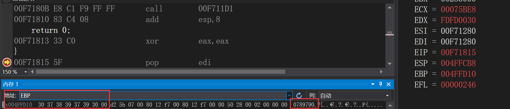

 # 缓冲区溢出-原理探究实验

# 实验目的

* 观察、测试和分析一段存在缓冲区溢出漏洞的代码
* 分析缓冲区溢出漏洞出现的原因和效果

# 实验环境

* VS2019

# 实验原理

## 缓冲区溢出

**定义**

> A buffer overflow, or buffer overrun, is an anomaly where a program, while writing data to a buffer, overruns the buffer's boundary and overwrites adjacent memory locations.

**原因**

> Programming languages commonly associated with buffer overflows include C and C++, which provide no built-in protection against accessing or overwriting data in any part of memory and do not automatically check that data written to an array (the built-in buffer type) is within the boundaries of that array.

* 没有提供内置的保护来防止访问或覆盖内存中任何部分的数据
* 不会自动检查写入数组的数据(内置缓冲区类型)是否在该数组的边界内

## 调用栈(call stack)

**定义**

> In computer science, a **call stack** is a stack data structure that stores information about the active subroutines of a computer program. This kind of stack is also known as an **execution stack, program stack, control stack, run-time stack, or machine stack**, and is often shortened to just "the stack". 
>
> A call stack is used for several related purposes, but the main reason for having one is **to keep track of the point to which each active subroutine should return control when it finishes executing**. An **active subroutine** is one that has been called, but is yet to complete execution, after which control should be handed back to the point of call. 

**栈帧**

> A call stack is composed of **stack frames** (also called activation records or activation frames). These are machine dependent and ABI-dependent data structures containing subroutine state information. Each stack frame corresponds to a call to a subroutine which has not yet terminated with a return. 
>
> * For example, if a subroutine named DrawLine is currently running, having been called by a subroutine DrawSquare, the top part of the call stack might be laid out like in the adjacent picture. 

<center></center>
### 补充

**缓冲区溢出与堆栈的关系**

> * Buffer overflow refers to any case in which a program writes beyond the end of the memory allocated for any buffer **(including on the heap, not  just on the stack)**.  For example, if you write past the end of an array  allocated from the heap, you've caused a buffer overflow.

* 缓冲区溢出不只是发生在**栈**中，还发生在**堆**中

**栈与堆的区别**

> Stack is used for static memory allocation and Heap for dynamic memory allocation

**栈溢出与堆溢出的区别**

> Heap Overflow
>
> *  continuously allocate memory and not free that memory space  after use it may result in memory leakage – memory is still being used  but not available for other processes
>
> * dynamically allocate large number of variables
>
>   ```c
>   // 1
>   for (int i=0; i<10000000; i++) 
>       { 
>          // Allocating memory without freeing it 
>          int *ptr = (int *)malloc(sizeof(int)); 
>       } 
>   // 2
>   int *ptr = (int *)malloc(sizeof(int)*10000000)); 
>   ```
>
> Stack Overflow
>
> * declare large number of local variables or declare an array or matrix or any higher dimensional array of large size can result in overflow of  stack
>
> * If function recursively call itself infinite times then the stack is  unable to store large number of local variables used by every function  call and will result in overflow of stack
>
>   ```c
>   // 1
>   int mat[100000][100000]; 
>   // 2
>   void fun(int x) 
>   { 
>       x = 6; 
>       fun(x); 
>   } 
>   ```
>
>   

# 实验内容

## 预备

**关闭IDE的安全检查**

* 关闭**SDL**(Security Development Lifecycle)检查
  * `C/C++`->`SDL检查`->`否`
* 关闭中间代码生成阶段的安全检查
  * `C/C++`->`代码生成`->`启用C++异常`->`否`
  * `C/C++`->`代码生成`->`基本运行时检查`：关闭
  * `C/C++`->`代码生成`->`安全检查`->`禁用安全检查`

## 漏洞代码

```c
#define _CRT_SECURE_NO_WARNINGS

#include <stdlib.h>
#include <stdio.h>
#include <string.h>

int sub(char* x)
{
    char y[10];
    strcpy(y, x);
    return 0;
}

int main(int argc, char** argv)
{
    if (argc > 1)
        sub(argv[1]);
    printf("exit");
}
```

* `#define _CRT_SECURE_NO_WARNINGS`

  > There are several ways to eliminate deprecation warnings for the older, less secure functions. The simplest is simply to define **_CRT_SECURE_NO_WARNINGS** or use the **warning pragma**. Either will disable deprecation warnings, but of course the security issues that caused the warnings still exist. 

**触发漏洞**

* `调试`->`命令参数`->`设置一段长度尽量大的字串(char y[10])`
* 字串尽量大，保证能覆盖栈帧的`Return Address`

# 实验结果

* 直接调试

  <center></center>

* 加上断点进行调试，证明覆盖了回调地址

  * 测试输入`123456`

    <center></center>
* `EAX`代表输入的的值的地址
    * `ECX`代表分配的`0Ch`空间的地址
    * `call 00F711D1`：strcpy函数
    * 可以看到执行字符串拷贝函数后，`EBP`仍然指向正确的返回地址`00EFFB4C`
    
* 测试输入`1234567891010789790`
  
  <center></center>
  * 可以看到执行字符串拷贝函数后，`EBP`元贝的内容被覆盖了

# 参考资料

[Call stack - Wikipedia](https://en.wikipedia.org/wiki/Call_stack#STACK-FRAME)

[Security Features in the CRT ](https://docs.microsoft.com/en-us/cpp/c-runtime-library/security-features-in-the-crt?view=vs-2019)

[Heap overflow and Stack overflow](https://www.geeksforgeeks.org/heap-overflow-stack-overflow/)

[What is the difference between a stack overflow and buffer overflow? - Stack Overflow](https://stackoverflow.com/questions/1120575/what-is-the-difference-between-a-stack-overflow-and-buffer-overflow)