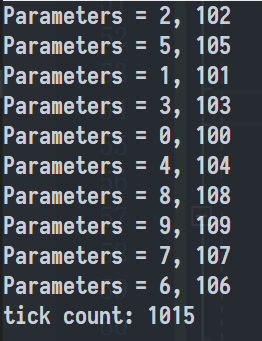
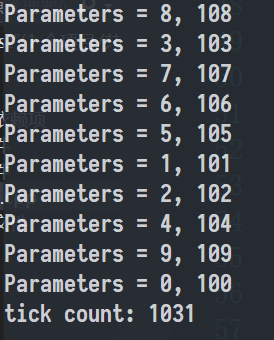
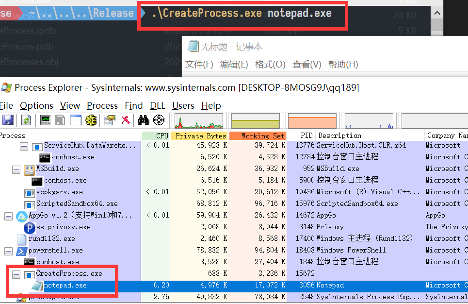

# c语言进线程实验

# 实验目的

* 学习创建多线程的方法
* 学习创建子进程的方法

# 实验环境

* VS2019

# 实验内容

## 创建线程示例

```c
typedef struct MyData {
    int val1;
    int val2;
} MYDATA, *PMYDATA;

for( int i=0; i<MAX_THREADS; i++ )
    {
        // Allocate memory for thread data.

        pDataArray[i] = (PMYDATA) HeapAlloc(GetProcessHeap(), HEAP_ZERO_MEMORY,
                sizeof(MYDATA));

        if( pDataArray[i] == NULL )
        {
           // If the array allocation fails, the system is out of memory
           // so there is no point in trying to print an error message.
           // Just terminate execution.
            ExitProcess(2);
        }

        // Generate unique data for each thread to work with.

        pDataArray[i]->val1 = i;
        pDataArray[i]->val2 = i+100;

        // Create the thread to begin execution on its own.

        hThreadArray[i] = CreateThread( 
            NULL,                   // default security attributes
            0,                      // use default stack size  
            MyThreadFunction,       // thread function name
            pDataArray[i],          // argument to thread function 
            0,                      // use default creation flags 
            &dwThreadIdArray[i]);   // returns the thread identifier 


        // Check the return value for success.
        // If CreateThread fails, terminate execution. 
        // This will automatically clean up threads and memory. 

        if (hThreadArray[i] == NULL) 
        {
           ErrorHandler(TEXT("CreateThread"));
           ExitProcess(3);
        }
    } // End of main thread creation loop.
```

## 创建单线程与多线程

**WaitForSingleObject**

> The **WaitForSingleObject** function checks the current state of the specified object. If the object's state is nonsignaled, the calling thread enters the wait state until the object is signaled or the time-out interval elapses.

```c
DWORD WaitForSingleObject(
  HANDLE hHandle,		// A handle to the object
  DWORD  dwMilliseconds		// The time-out interval, in milliseconds. 
);
```

**WaitForMultipleObjects** 

> The **WaitForMultipleObjects** function determines whether the wait criteria have been met. If the criteria have not been met, the calling thread enters the wait state until the conditions of the wait criteria have been met or the time-out interval elapses.
>
> When *bWaitAll* is **TRUE**, the function's wait operation is completed only when the states of all objects have been set to signaled. The function does not modify the states of the specified objects until the states of all objects have been set to signaled. For example, a mutex can be signaled, but the thread does not get ownership until the states of the other objects are also set to signaled. In the meantime, some other thread may get ownership of the mutex, thereby setting its state to nonsignaled.
>
> When *bWaitAll* is **FALSE**, this function checks the handles in the array in order starting with index 0, until one of the objects is signaled. If multiple objects become signaled, the function returns the index of the first handle in the array whose object was signaled.

```c
//在指定的时间内等待多个对象为可用状态
// 阻塞队列
DWORD WaitForMultipleObjects(
  DWORD        nCount,
  const HANDLE *lpHandles,
  BOOL         bWaitAll,
  DWORD        dwMilliseconds
);
```

## 多线程

* 计时

  ```c
  DWORD start = GetTickCount();
  ...
  DWORD end = GetTickCount();
  printf("tick count: %d\n", end - start);
  ```

* 多线程

  * 1

    ```c
    WaitForMultipleObjects(MAX_THREADS, hThreadArray, TRUE, INFINITE);
    ```

  * 2

    ```c
    for (auto i : hThreadArray)
    {
        WaitForSingleObject(i, INFINITE);
    }
    ```

* 线程函数`MyThreadFunction`

  ```c
  	Sleep(1000);
  	printf("Parameters = %d, %d\n", pDataArray->val1, pDataArray->val2);
  ```

**结果**

* 当线程数`MAX_THREADS=10`

  * `WaitForSingleObject`

    <center></center>

  * `WaitForMultipleObjects`

    <center></center>

## 创建进程

```c
void _tmain( int argc, TCHAR *argv[] )
{
    STARTUPINFO si;
    PROCESS_INFORMATION pi;

    ZeroMemory( &si, sizeof(si) );
    si.cb = sizeof(si);
    ZeroMemory( &pi, sizeof(pi) );

    if( argc != 2 )
    {
        printf("Usage: %s [cmdline]\n", argv[0]);
        return;
    }

    // Start the child process. 
    if( !CreateProcess( NULL,   // No module name (use command line)
        argv[1],        // Command line
        NULL,           // Process handle not inheritable
        NULL,           // Thread handle not inheritable
        FALSE,          // Set handle inheritance to FALSE
        0,              // No creation flags
        NULL,           // Use parent's environment block
        NULL,           // Use parent's starting directory 
        &si,            // Pointer to STARTUPINFO structure
        &pi )           // Pointer to PROCESS_INFORMATION structure
    ) 
    {
        printf( "CreateProcess failed (%d).\n", GetLastError() );
        return;
    }

    // Wait until child process exits.
    WaitForSingleObject( pi.hProcess, INFINITE );

    // Close process and thread handles. 
    CloseHandle( pi.hProcess );
    CloseHandle( pi.hThread );
}
```

## 用`CreateProcess`打开子进程

* 生成`CreateProcesses.exe`

* 命令行执行`CreateProcesses.exe notepad.exe`，弹出记事本。再用`Process Explorer`查看

  <center></center>


# 参考资料

[Creating Threads - Win32 apps | Microsoft Docs](https://docs.microsoft.com/zh-cn/windows/win32/procthread/creating-threads)

[Creating Processes - Win32 apps](https://docs.microsoft.com/zh-cn/windows/win32/procthread/creating-processes)