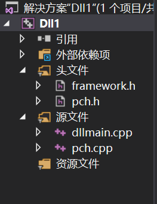
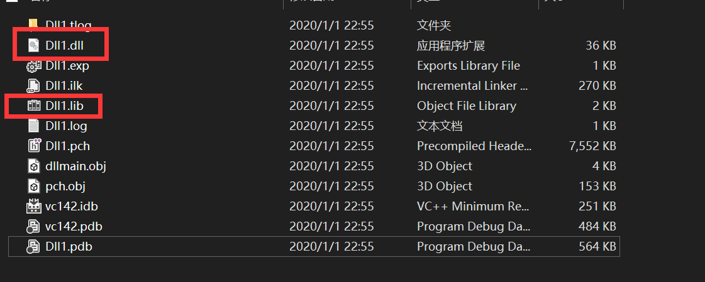
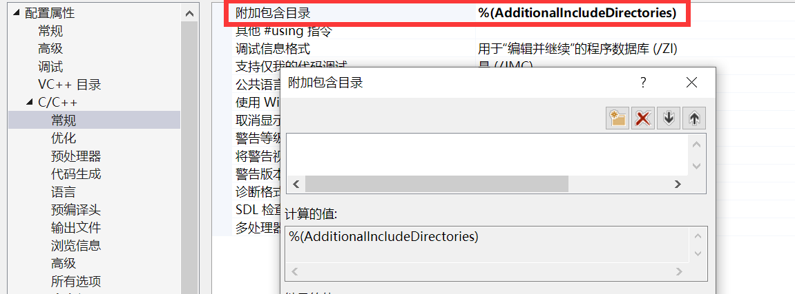
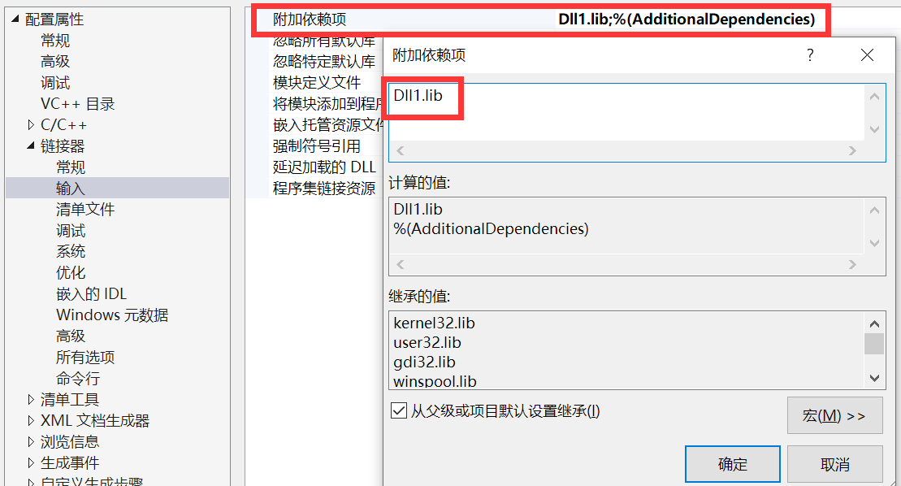
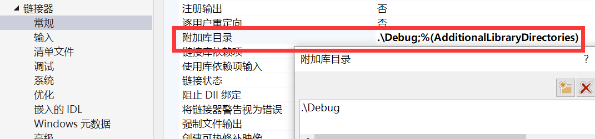
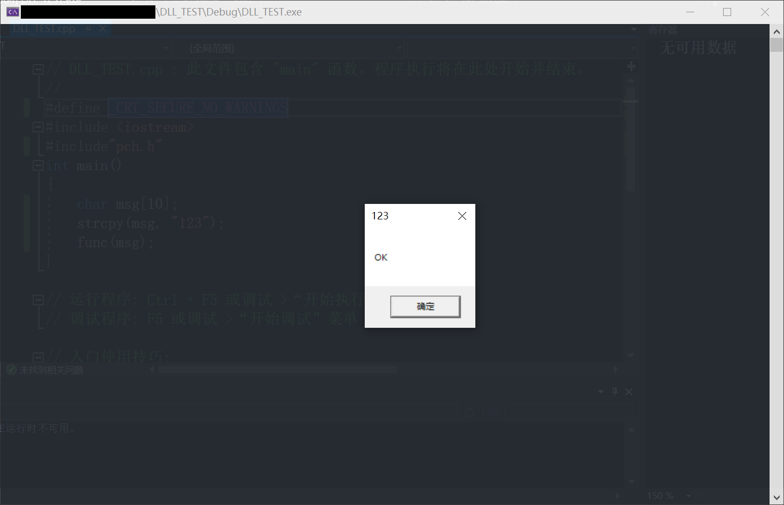

# 创建和使用DLL

# 实验目的

* 在 Visual Studio 中创建 DLL 项目。
* 将导出的函数和变量添加到该 DLL。
* 在 Visual Studio 中创建一个控制台应用项目。
* 在该控制台应用中使用从 DLL 导入的函数和变量。
* 运行已完成的应用。
* **手工编写DLL**

<!--more-->

# 实验环境

* VS2019

# 实验原理

`dllexport`、`dllimport`

> **Microsoft Specific**
>
> The dllexport and dllimport storage-class attributes are Microsoft-specific extensions to the C and C++ languages. You can use them to export and import functions, data, and objects to or from a DLL.
>
> ---
>
> These attributes explicitly define the DLL's interface to its client, which can be the executable file or another DLL. Declaring functions as dllexport eliminates the need for a module-definition **(.def)** file, at least with respect to the specification of exported functions. The dllexport attribute replaces the __export keyword.

# 实验内容

## VS编写与引入DLL

**编写DLL**

* 新建项目，选择 **动态链接库（DLL）**，默认项目目录如下👇

  <center></center>

* 修改`pch.h`

  ```c
  #ifndef PCH_H
  #define PCH_H
  
  #ifdef _EXPORTING
  #define API_DECLSPEC __declspec(dllexport)
  #else
  #define API_DECLSPEC __declspec(dllimport)
  #endif
  // 添加要在此处预编译的标头
  #include "framework.h"
  
  #endif //PCH_H
  
  
  API_DECLSPEC void func(char* msg);
  ```

* 修改`pch.cpp`

  ```c
  #include "pch.h"
  void func(char* msg)
  {
  	MessageBoxA(0,"OK", msg, MB_OK);
  }
  ```

* 调试，在`debug`目录下生成`.lib`和`.dll`文件

  <center></center>

**引入DLL**

* 新开控制台项目，新建源文件

  ```c
  #define _CRT_SECURE_NO_WARNINGS
  #include <iostream>
  #include"pch.h"
  int main()
  {
  	char msg[10];
  	strcpy(msg, "123");
  	func(msg);
  }
  ```

* (可选)将DLL项目下的四个默认生成文件与DEBUG文件夹拷贝到当前目录下

* 进行如下配置👇

  * 将 DLL 标头添加到包含路径

    <center></center>
  
* 指定指向 `pch.h` 头文件的位置的路径
  
  * 因为已经拷贝到当前目录，所以可以缺省
    * **此时可以编译通过，但无法链接**，这是由于还未指定`.lib`文件的目录
  
* 将 DLL 导入库添加到项目中
  
  <center></center>
  * 指定静态数据连接库文件
  
    <center></center>
    * 指定库所在地址——`Debug`目录下

**运行结果**

* 调试

  <center></center>

* 用`Process Explorer`查看

  <center></center>

## 手工编写与引入DLL

* 创建源文件

  ```c
  #include <Windows.h>
  // 不会被导出的函数
  int intnal_function() {
      return 0;
  }
  // 会被导出的函数
  int lib_function(char* msg) {
      printf("1");
      return 0;
  }
  ```

* 创建`.def`文件

  > 其含义是将导出的lib文件命名为`baselib`和只把`lib_function`函数导出

  ```
  LIBRARY   baselib
  EXPORTS
      lib_function
  ```

* 编译：`cl /c x.cpp`

* 链接：`link x.obj /out:baselib.dll /dll /def:Source.def`

* 结果

  <center></center>

### 常见问题及解决

**`不包括路径集\无法打开xx.h`**

* 编译：在环境变量中新建`INCLUDE`，添加`.h`所在目录地址
* 链接：在环境变量中新建`LIB`，添加`.lib`所在目录地址

# 参考资料

[演练：创建和使用自己的动态链接库 (C++)](https://docs.microsoft.com/zh-cn/cpp/build/walkthrough-creating-and-using-a-dynamic-link-library-cpp?view=vs-2019)

[dllexport, dllimport | Microsoft Docs](https://docs.microsoft.com/en-us/cpp/cpp/dllexport-dllimport?view=vs-2019)

[命令行下cl.exe编译链接的问题及解决方法 - ShadonSniper - 博客园](https://www.cnblogs.com/hiccup/p/5424009.html)