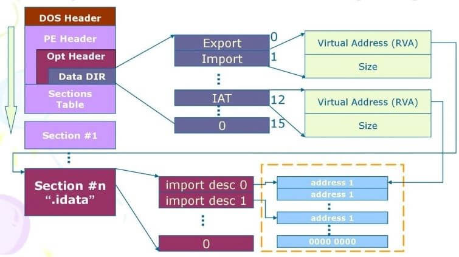
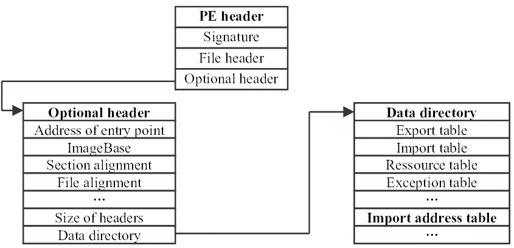
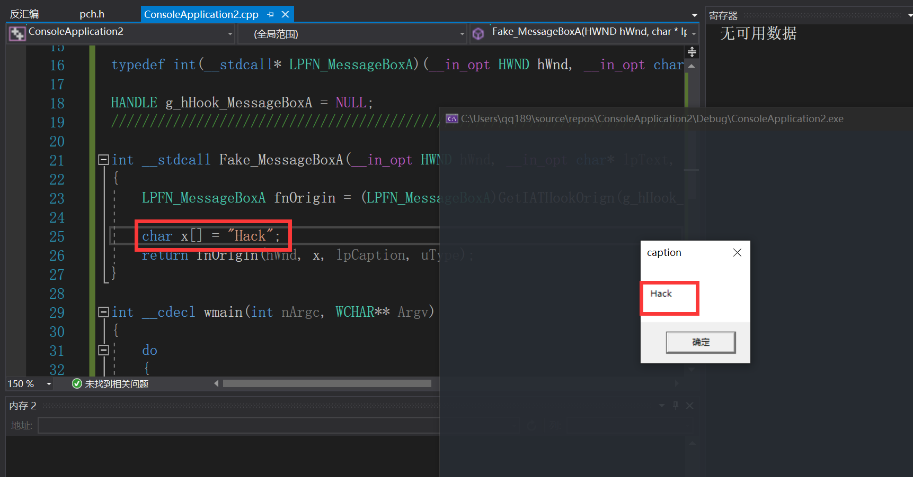
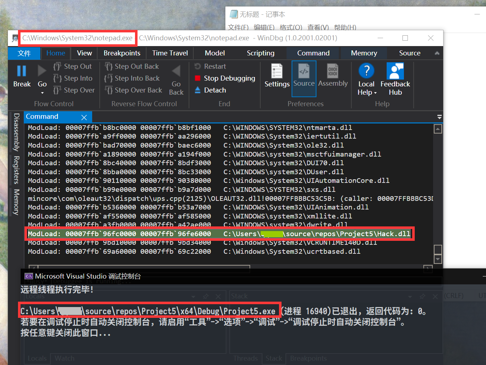

# 实验目的

* 了解`Hook`技术的基本原理
* 利用`IATHook`篡改notepad输入内容（`WriteFile`函数）

<!--more-->

# 实验原理

**导入地址表(IAT )**

> 全称Import Address Table。由于**导入函数就是被程序调用但其执行代码又不在程序中的函数**，这些函数的代码位于一个或者多个DLL 中.当PE 文件被装入内存的时候，Windows 装载器才将DLL 装入，并将调用导入函数的指令和函数实际所处的地址联系起来(动态连接)，**这操作就需要导入表完成.其中导入地址表就指示函数实际地址**

<center></center>
**HOOK**

> 在计算机编程中，术语HOOK涵盖了一系列的技术，用于通过**拦截软件组件之间传递的函数调用或消息或事件**来改变或增强操作系统，应用程序或其他软件组件的行为。处理此类截获的函数调用，事件或消息的代码称为**钩子**

**IAT Hook**

> 操纵导入地址表将API函数重定向到所需的存储器地址。该地址可以是另一个API函数，恶意的`shellcode`或程序代码的另一部分

* 进程内存中查找IAT表的地址：在位于PE文件的可选头部内的数据目录中

  <center></center>


**DLL注入**

> DLL注入时指向运行中的其他进程强制插入特定的DLL文件。从技术细节来说，DLL注入命令其他进程自行调用LoadLibrary() API，加载用户指定的DLL文件。
>
> DLL被加载到进程后会自动运行DllMain()函数，用户可以把想执行的代码放到DllMain()函数，每当加载DLL时，添加的代码就会自然得到执行。
>
> ---
>
> ```c
> BOOL WINAPI DllMain(HINSTANCE hinstDLL, DWORD fdwReason, LPVOID lpvReserved)
> {
>  switch( fdwReason )
>  {
>      case DLL_PROCESS_ATTACH : 
>          hook();
>        	break;
>    
>   case DLL_PROCESS_DETACH :
>          unhook();
>          break;
>    }
>    
> return TRUE;
>    }
>    ```

**WriteFile**

> Writes data to the specified file or input/output (I/O) device
>
> ---
>
> **Requirements**
>
> | **Target Platform** | Windows                       |
> | ------------------- | ----------------------------- |
> | **Header**          | fileapi.h (include Windows.h) |
> | **Library**         | Kernel32.lib                  |
> | **DLL**             | Kernel32.dll                  |

```c
BOOL WriteFile(
  HANDLE       hFile,             // 文件句柄
  LPCVOID      lpBuffer,           // 要写入的数据
  DWORD        nNumberOfBytesToWrite,  // 要写入的字节数
  LPDWORD      lpNumberOfBytesWritten,  // 实际写入的字节数
  LPOVERLAPPED lpOverlapped					// OVERLAPPED 结构，一般设定为 NULL
);
```

**iat_hook**

```c
#ifdef _RING0
#include <ntddk.h>
#include <ntimage.h>
#else
#include <windows.h>
#include <stdlib.h>
#endif //#ifdef _RING0


//////////////////////////////////////////////////////////////////////////

typedef struct _IATHOOK_BLOCK
{
	void*	pOrigin;

	void*	pImageBase;
	const char*	pszImportDllName;
	const char*	pszRoutineName;

	void*	pFake;

}IATHOOK_BLOCK;


//////////////////////////////////////////////////////////////////////////

void* _IATHook_Alloc(__in ULONG nNeedSize)
{
	void* pMemory = NULL;

	do
	{
		if (0 == nNeedSize)
		{
			break;
		}

#ifdef _RING0
		pMemory = ExAllocatePoolWithTag(NonPagedPool, nNeedSize, 'iath');

#else
		pMemory = malloc(nNeedSize);
#endif // #ifdef _RING0

		if (NULL == pMemory)
		{
			break;
		}

		RtlZeroMemory(pMemory, nNeedSize);

	} while (FALSE);

	return pMemory;
}


ULONG _IATHook_Free(__in void* pMemory)
{

	do
	{
		if (NULL == pMemory)
		{
			break;
		}

#ifdef _RING0
		ExFreePool(pMemory);

#else
		free(pMemory);
#endif // #ifdef _RING0

		pMemory = NULL;

	} while (FALSE);

	return 0;
}

//////////////////////////////////////////////////////////////////////////
#ifdef _RING0


#ifndef LOWORD
#define LOWORD(l)           ((USHORT)((ULONG_PTR)(l) & 0xffff))
#endif // #ifndef LOWORD


void*  _IATHook_InterlockedExchangePointer(__in void* pAddress, __in void* pValue)
{
	void*	pWriteableAddr = NULL;
	PMDL	pNewMDL = NULL;
	void*	pOld = NULL;

	do
	{
		if ((NULL == pAddress))
		{
			break;
		}

		if (!NT_SUCCESS(MmIsAddressValid(pAddress)))
		{
			break;
		}

		pNewMDL = IoAllocateMdl(pAddress, sizeof(void*), FALSE, FALSE, NULL);
		if (pNewMDL == NULL)
		{
			break;
		}

		__try
		{
			MmProbeAndLockPages(pNewMDL, KernelMode, IoWriteAccess);

			pNewMDL->MdlFlags |= MDL_MAPPING_CAN_FAIL;

			pWriteableAddr = MmMapLockedPagesSpecifyCache(
				pNewMDL,
				KernelMode,
				MmNonCached,
				NULL,
				FALSE,
				HighPagePriority
			);

			//pWriteableAddr = MmMapLockedPages(pNewMDL, KernelMode);
		}
		__except (EXCEPTION_EXECUTE_HANDLER)
		{
			break;
		}

		if (pWriteableAddr == NULL)
		{
			MmUnlockPages(pNewMDL);
			IoFreeMdl(pNewMDL);

			break;
		}

		pOld = InterlockedExchangePointer(pWriteableAddr, pValue);

		MmUnmapLockedPages(pWriteableAddr, pNewMDL);
		MmUnlockPages(pNewMDL);
		IoFreeMdl(pNewMDL);

	} while (FALSE);

	return pOld;
}


//////////////////////////////////////////////////////////////////////////
#else

void*  _IATHook_InterlockedExchangePointer(__in void* pAddress, __in void* pValue)
{
	void*	pWriteableAddr = NULL;
	void*	nOldValue = NULL;
	ULONG	nOldProtect = 0;
	BOOL	bFlag = FALSE;

	do
	{
		if ((NULL == pAddress))
		{
			break;
		}

		bFlag = VirtualProtect(pAddress, sizeof(void*), PAGE_EXECUTE_READWRITE, &nOldProtect);
		if (!bFlag)
		{
			break;
		}
		pWriteableAddr = pAddress;

		nOldValue = InterlockedExchangePointer((PVOID volatile *)pWriteableAddr, pValue);

		VirtualProtect(pAddress, sizeof(void*), nOldProtect, &nOldProtect);

	} while (FALSE);

	return nOldValue;
}

#endif // #ifdef _RING0


LONG _IATHook_Single
(
	__in IATHOOK_BLOCK*	pHookBlock,
	__in IMAGE_IMPORT_DESCRIPTOR*	pImportDescriptor,
	__in BOOLEAN bHook
)
{
	LONG				nFinalRet = -1;

	IMAGE_THUNK_DATA*	pOriginThunk = NULL;
	IMAGE_THUNK_DATA*	pRealThunk = NULL;

	IMAGE_IMPORT_BY_NAME*	pImportByName = NULL;

	do
	{
		pOriginThunk = (IMAGE_THUNK_DATA*)((UCHAR*)pHookBlock->pImageBase + pImportDescriptor->OriginalFirstThunk);
		pRealThunk = (IMAGE_THUNK_DATA*)((UCHAR*)pHookBlock->pImageBase + pImportDescriptor->FirstThunk);

		for (; 0 != pOriginThunk->u1.Function; pOriginThunk++, pRealThunk++)
		{
			if (IMAGE_ORDINAL_FLAG == (pOriginThunk->u1.Ordinal & IMAGE_ORDINAL_FLAG))
			{
				if ((USHORT)pHookBlock->pszRoutineName == LOWORD(pOriginThunk->u1.Ordinal))
				{
					if (bHook)
					{
						pHookBlock->pOrigin = (void*)pRealThunk->u1.Function;
						_IATHook_InterlockedExchangePointer((void**)&pRealThunk->u1.Function, pHookBlock->pFake);
					}
					else
					{
						_IATHook_InterlockedExchangePointer((void**)&pRealThunk->u1.Function, pHookBlock->pOrigin);
					}

					nFinalRet = 0;
					break;
				}
			}
			else
			{
				pImportByName = (IMAGE_IMPORT_BY_NAME*)((char*)pHookBlock->pImageBase + pOriginThunk->u1.AddressOfData);

				if (0 == _stricmp(pImportByName->Name, pHookBlock->pszRoutineName))
				{
					if (bHook)
					{
						pHookBlock->pOrigin = (void*)pRealThunk->u1.Function;
						_IATHook_InterlockedExchangePointer((void**)&pRealThunk->u1.Function, pHookBlock->pFake);
					}
					else
					{
						_IATHook_InterlockedExchangePointer((void**)&pRealThunk->u1.Function, pHookBlock->pOrigin);
					}

					nFinalRet = 0;

					break;
				}
			}

		}

	} while (FALSE);

	return nFinalRet;
}


LONG _IATHook_Internal(__in IATHOOK_BLOCK* pHookBlock, __in BOOLEAN bHook)
{
	LONG				nFinalRet = -1;
	LONG				nRet = -1;
	IMAGE_DOS_HEADER*	pDosHeader = NULL;
	IMAGE_NT_HEADERS*	pNTHeaders = NULL;

	IMAGE_IMPORT_DESCRIPTOR*	pImportDescriptor = NULL;
	char*						pszImportDllName = NULL;


	do
	{
		if (NULL == pHookBlock)
		{
			break;
		}

		pDosHeader = (IMAGE_DOS_HEADER*)pHookBlock->pImageBase;
		if (IMAGE_DOS_SIGNATURE != pDosHeader->e_magic)
		{
			break;
		}

		pNTHeaders = (IMAGE_NT_HEADERS*)((UCHAR*)pHookBlock->pImageBase + pDosHeader->e_lfanew);
		if (IMAGE_NT_SIGNATURE != pNTHeaders->Signature)
		{
			break;
		}

		if (0 == pNTHeaders->OptionalHeader.DataDirectory[IMAGE_DIRECTORY_ENTRY_IMPORT].VirtualAddress)
		{
			break;
		}

		if (0 == pNTHeaders->OptionalHeader.DataDirectory[IMAGE_DIRECTORY_ENTRY_IMPORT].Size)
		{
			break;
		}

		pImportDescriptor = (IMAGE_IMPORT_DESCRIPTOR*)((UCHAR*)pHookBlock->pImageBase + pNTHeaders->OptionalHeader.DataDirectory[IMAGE_DIRECTORY_ENTRY_IMPORT].VirtualAddress);


		// Find pszRoutineName in every Import descriptor
		nFinalRet = -1;

		for (; (pImportDescriptor->Name != 0); pImportDescriptor++)
		{
			pszImportDllName = (char*)pHookBlock->pImageBase + pImportDescriptor->Name;

			if (NULL != pHookBlock->pszImportDllName)
			{
				if (0 != _stricmp(pszImportDllName, pHookBlock->pszImportDllName))
				{
					continue;
				}
			}

			nRet = _IATHook_Single(
				pHookBlock,
				pImportDescriptor,
				bHook
			);

			if (0 == nRet)
			{
				nFinalRet = 0;
				break;
			}
		}

	} while (FALSE);

	return nFinalRet;
}

LONG IATHook
(
	__in void* pImageBase,
	__in_opt const char* pszImportDllName,
	__in const char* pszRoutineName,
	__in void* pFakeRoutine,
	__out HANDLE* Param_phHook
)
{
	LONG				nFinalRet = -1;
	IATHOOK_BLOCK*		pHookBlock = NULL;


	do
	{
		if ((NULL == pImageBase) || (NULL == pszRoutineName) || (NULL == pFakeRoutine))
		{
			break;
		}

		pHookBlock = (IATHOOK_BLOCK*)_IATHook_Alloc(sizeof(IATHOOK_BLOCK));
		if (NULL == pHookBlock)
		{
			break;
		}
		RtlZeroMemory(pHookBlock, sizeof(IATHOOK_BLOCK));

		pHookBlock->pImageBase = pImageBase;
		pHookBlock->pszImportDllName = pszImportDllName;
		pHookBlock->pszRoutineName = pszRoutineName;
		pHookBlock->pFake = pFakeRoutine;

		__try
		{
			nFinalRet = _IATHook_Internal(pHookBlock, TRUE);
		}
		__except (EXCEPTION_EXECUTE_HANDLER)
		{
			nFinalRet = -1;
		}

	} while (FALSE);

	if (0 != nFinalRet)
	{
		if (NULL != pHookBlock)
		{
			_IATHook_Free(pHookBlock);
			pHookBlock = NULL;
		}
	}

	if (NULL != Param_phHook)
	{
		*Param_phHook = pHookBlock;
	}

	return nFinalRet;
}

LONG UnIATHook(__in HANDLE hHook)
{
	IATHOOK_BLOCK*		pHookBlock = (IATHOOK_BLOCK*)hHook;
	LONG				nFinalRet = -1;

	do
	{
		if (NULL == pHookBlock)
		{
			break;
		}

		__try
		{
			nFinalRet = _IATHook_Internal(pHookBlock, FALSE);
		}
		__except (EXCEPTION_EXECUTE_HANDLER)
		{
			nFinalRet = -1;
		}

	} while (FALSE);

	if (NULL != pHookBlock)
	{
		_IATHook_Free(pHookBlock);
		pHookBlock = NULL;
	}

	return nFinalRet;
}

void* GetIATHookOrign(__in HANDLE hHook)
{
	IATHOOK_BLOCK*		pHookBlock = (IATHOOK_BLOCK*)hHook;
	void*				pOrigin = NULL;

	do
	{
		if (NULL == pHookBlock)
		{
			break;
		}

		pOrigin = pHookBlock->pOrigin;

	} while (FALSE);

	return pOrigin;
}
```

# 实验内容

## 0. messagebox

* 构造FakeMessageBox

  ```c
  	LPFN_MessageBoxA fnOrigin = (LPFN_MessageBoxA)GetIATHookOrign(g_hHook_MessageBoxA);
  
  	char x[] = "Hack";
  	return fnOrigin(hWnd, x, lpCaption, uType);
  ```

* Main

  ```c
  int __cdecl wmain(int nArgc, WCHAR** Argv)
  {
  	do 
  	{
  		UNREFERENCED_PARAMETER(nArgc);
  		UNREFERENCED_PARAMETER(Argv);
  
  		IATHook(
  			GetModuleHandleW(NULL) ,
  			"user32.dll" , 
  			"MessageBoxA" ,
  			Fake_MessageBoxA ,
  			&g_hHook_MessageBoxA
  		);
  		
  		MessageBoxA(NULL , "test" , "caption" , 0);
  
  		UnIATHook( g_hHook_MessageBoxA);
  
  		MessageBoxA(NULL , "test" , "caption" , 0);
  	
  	} while (FALSE);
  	
  	return 0;
  }
  ```

* **结果**

  * 先弹框`Hack`，尔后弹框`test`

    <center></center>

## 1.notepad

* 构造`FakeWriteFile`

  ```c
  bool __stdcall FakeWriteFile(
  	HANDLE       hFile,
  	LPCVOID      lpBuffer,
  	DWORD        nNumberOfBytesToWrite,
  	LPDWORD      lpNumberOfBytesWritten,
  	LPOVERLAPPED lpOverlapped
  ) 
  {
  	LPFN_WriteFile fnOrigin = (LPFN_WriteFile)GetIATHookOrign(g_hHook_WriteFile);
  
  	char DataBuffer[] = "Hacker Hacked";
  	DWORD dwBytesToWrite = (DWORD)strlen(DataBuffer);
  	DWORD dwBytesWritten = 0;
  
  	return fnOrigin(hFile, DataBuffer, dwBytesToWrite, &dwBytesWritten, lpOverlapped);
  }
  ```

* 构建`DllMain`

  ```c
  BOOL WINAPI DllMain(HINSTANCE hinstDll, DWORD dwReason, LPVOID lpvRevered) {
  	switch (dwReason) {
  	case DLL_PROCESS_ATTACH:
  		IATHook(
  			GetModuleHandle(NULL),
  			"kernel32.dll",
  			"WriteFile",
  			FakeWriteFile,
  			&g_hHook_WriteFile
  		);
  		break;
  	case DLL_PROCESS_DETACH:
  		UnIATHook(g_hHook_WriteFile);
  		break;
  	}
  	return TRUE;
  }
  ```
  
* iat_hook

  * 如前

* DllInject，注意需要在VS中用`x64`运行

  ```c
  #include <windows.h>
  #include <stdio.h>
  #include <tlhelp32.h>
  
  int main() {
  	char szDllName[] = "..\\..\\Hack.dll";
  	char szExeName[] = "notepad.exe";
  
  	// 读取进程列表，获得目标进程的PID
  	PROCESSENTRY32 ProcessEntry = {};
  	ProcessEntry.dwSize = sizeof(PROCESSENTRY32);
  	HANDLE hProcessSnap = CreateToolhelp32Snapshot(TH32CS_SNAPPROCESS, 0);
  	bool bRet = Process32First(hProcessSnap, &ProcessEntry);
  	DWORD dwProcessId = 0;
  	while (bRet) {
  		if (strcmp(szExeName, ProcessEntry.szExeFile) == 0) {
  			dwProcessId = ProcessEntry.th32ProcessID;
  			break;
  		}
  		bRet = Process32Next(hProcessSnap, &ProcessEntry);
  	}
  	if (0 == dwProcessId) {
  		printf("找不到进程\n");
  		return 1;
  	}
  
  	// 利用PID获得进程句柄
  	HANDLE hProcess = OpenProcess(PROCESS_ALL_ACCESS, FALSE, dwProcessId);
  	if (0 == hProcess) {
  		printf("无法打开进程\n");
  		return 1;
  	}
  
  	// 在进程当中去分配空间
  	size_t length = strlen(szDllName) + 1;
  	char* pszDllFile = (char*)VirtualAllocEx(hProcess, NULL, length, MEM_COMMIT, PAGE_READWRITE);
  	if (0 == pszDllFile) {
  		printf("远程空间分配失败\n");
  		return 1;
  	}
  
  	// 将函数的参数写到进程空间中去
  	if (!WriteProcessMemory(hProcess, (PVOID)pszDllFile, (PVOID)szDllName, length, NULL)) {
  		printf("远程空间写入失败\n");
  		return 1;
  	}
  
  	// 获取LoadLibraryA函数
  	PTHREAD_START_ROUTINE pfnThreadRtn = (PTHREAD_START_ROUTINE)GetProcAddress(GetModuleHandle("kernel32"), "LoadLibraryA");
  	if (0 == pfnThreadRtn) {
  		printf("LoadLibraryA函数地址获取失败\n");
  		return 1;
  	}
  
  	// 在目标进程中根据函数地址和参数创建进程
  	HANDLE hThread = CreateRemoteThread(hProcess, NULL, 0, pfnThreadRtn, (PVOID)pszDllFile, 0, NULL);
  	if (0 == hThread) {
  		printf("远程线程创建失败\n");
  		return 1;
  	}
  
  	// 等待进程执行完毕
  	WaitForSingleObject(hThread, INFINITE);
  	printf("远程线程执行完毕!\n");
  
  	VirtualFreeEx(hProcess, (PVOID)pszDllFile, 0, MEM_RELEASE);
  	CloseHandle(hThread);
  	CloseHandle(hProcess);
  
  	return 0;
  }
  ```

* **结果**

  * 用`winDBG`打开`notepad.exe`，运行`DllInject`,可以看到成功实现了DLL注入

    <center></center>

  * 保存的txt内容并没有变成`Hacker Hacked`，猜测原因是ASLR(Address space layout randomization， **地址空间配置随机加载**)，使得并没有获得目标真实的`LoadLibraryA`

    > it seems that that notepad.exe uses ASLR and your test program does not. With that the address of LoadLibraryA would be different in each process, and your injection code fails.
    >
    > The situation is that you are getting the addres of LoadLibraryA in the injector address space and assume that it is the same that in the target process. That would be usually right, but ASLR is designed specifically to make that assumption fail. And so it does... the thread you create get a -most likely- invalid address, and fails.

# 参考资料

[IAT Hook 技术分析 - 云+社区 - 腾讯云](https://cloud.tencent.com/developer/article/1373802)

[DLL注入 - dlive - 博客园](https://www.cnblogs.com/dliv3/p/6349738.html)

[WriteFile function (fileapi.h) - Win32 apps](https://docs.microsoft.com/en-us/windows/win32/api/fileapi/nf-fileapi-writefile)

[C/C++ 文件操作之CreateFile函数、ReadFile函数和WriteFile函数的用法](http://www.365jz.com/article/24618)

[tinysec/iathook: windows kernelmode and usermode IAT hook](https://github.com/tinysec/iathook)