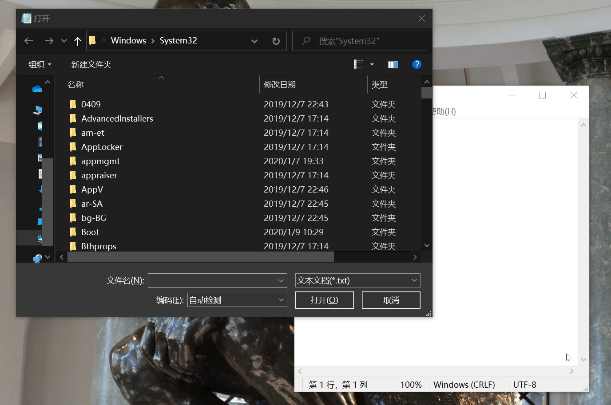
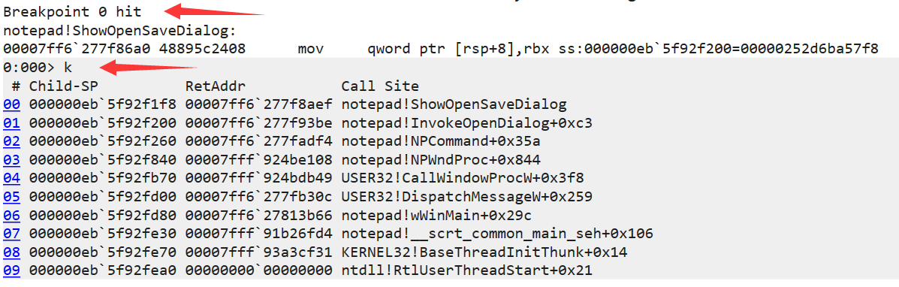
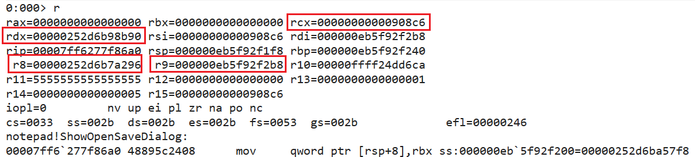
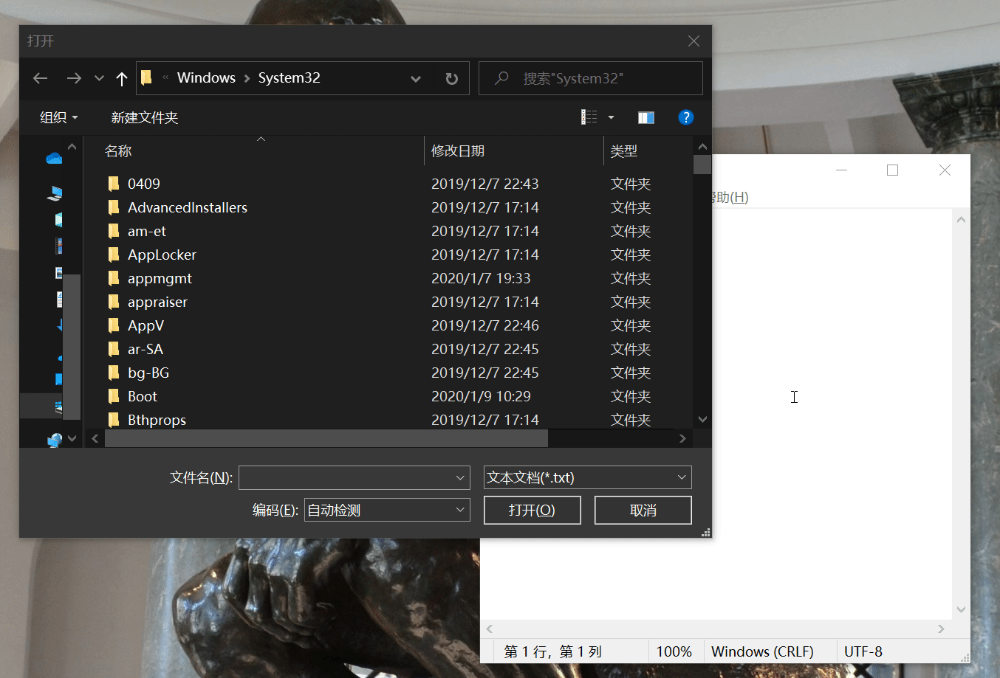
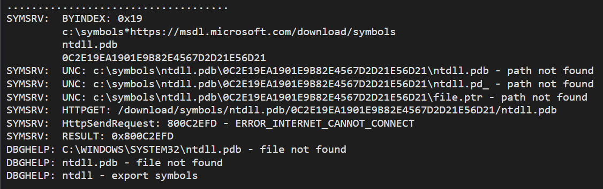

# winDBG实验

# 实验目的

* 熟悉WinDBG的使用和一些常用命令

* 利用`WinDBG`，使notepad.exe`在`文件`->`打开窗口`时仍然能在`文字编辑窗口`输入

  * 正常情况👇

    

# 实验原理

**winDBG**

> WinDbg is a multipurpose debugger for the Microsoft Windows computer operating system, distributed by Microsoft. **Debugging is the process of finding and resolving errors in a system; in computing it also includes exploring the internal operation of software as a help to development.** It can be used to debug user mode applications, device drivers, and the operating system itself in kernel mode. 
>
> * Wikipedia contributors. (2019, October 20). WinDbg.

PDB

> Program database (PDB) is a proprietary file format (developed by Microsoft) for storing debugging information about a program (or, commonly, program modules such as a DLL or EXE). PDB files commonly have a .pdb extension. A PDB file is typically created from source files during compilation. **It stores a list of all symbols in a module with their addresses and possibly the name of the file and the line on which the symbol was declared**. 
>
> ---
>
> When a program is debugged, the debugger loads debugging information from the PDB file and uses it to locate symbols or relate current execution state of a program source code. Microsoft Visual Studio uses PDB files as its primary file format for debugging information. 
>
> * Wikipedia contributors. (2019, October 15). Program database.

# 实验步骤

**寻找入侵函数**

* 载入`.pdb`符号信息

  * `.symfix`确认`ntdll.pdb`路径
  * `.reload`载入符号信息

* 确定与`打开`相关的函数

  * 根据命名规则，过滤名称有`open`的函数：`x notepad!*open*`

    * `x`：以通配符的方式检查一个模块你内的符号地址

      

  * 锁定`ShowOpenSaveDialog`，加上断点(**breakpoint**)后并执行(`g`)后，在记事本中`文件`->`打开`

    * `bp notepad!ShowOpenSaveDialog`

      

  * `Child-SP`：当前调用栈的栈顶指针
      * `RetAddr`：函数返回地址
      * `Call Site`：调用函数
      
  * 由此，证明`ShowOpenSaveDialog`是需要修改的函数
  
* 猜测是父进程(`文字编辑窗口`)调用了该函数打开了子进程(`文件打开窗口`)，证明

  > 调用约定简化了：一律使用__fastcall，前四个参数用 RCX、RDX、R8 和 R9传递，除了这四个外加RAX、R10、R11，其他寄存器都是非易失的

  * 查看寄存器信息

    

* ` rcx`与`HWND(Handle to Window)`的值的格式类似
  
  * 可以假设`rcx`就是窗口句柄
  
* 覆盖`rcx`的值：`r @rcx=0`再从断点继续执行

  * **实验结果**

    

# 常见问题解决

**找不到`ntdll.pdb`**

**解决**

* 联网，(自动)从`https://msdl.microsoft.com/download/symbols`下载

# 参考资料

[x64 软件约定 MS-Docs](https://docs.microsoft.com/zh-cn/cpp/build/x64-software-conventions?view=vs-2019)

[X64的调用约定_Returns' Station-CSDN博客](https://blog.csdn.net/Shevacoming/article/details/7773806)

[Hacking with Windbg - CodeProject](https://www.codeproject.com/Articles/1276860/Hacking-with-Windbg-Part-1-Notepad)

